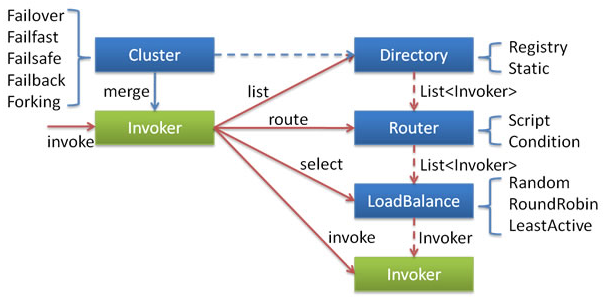
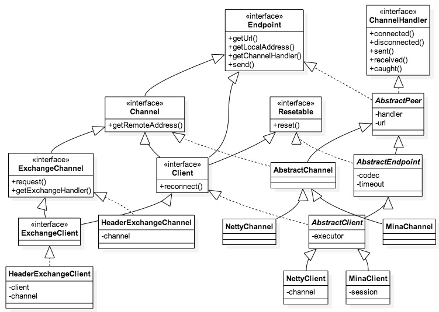

## Dubbo源码解析 --- Invoker和Exchanger
----------

##### 前言<br/>
在一个框架中我们通常把负责数据交换和网络通信的组件叫做Exchanger。Dubbo中每个Invoker都维护了一个ExchangeClient的引用，并通过它和远程的Server进行通信。<br/>

### Invoker<br/>
先来看一下官方文档中对inoker的介绍：<br/>

* **Invoker是Provider的一个可调用Service的抽象，Invoker封装了Provider地址及Service接口信息。**<br/>
* **Directory代表多个Invoker**，可以把它看成invoker的list集合，但与List不同的是，它的值可能是动态变化的，比如注册中心推送变更。<br/>
* **Cluster将Directory中的多个Invoker伪装成一个Invoker**，对上层透明，伪装过程包含了容错逻辑，调用失败后，重试另一个。<br/>
* **Router负责从多个Invoker中按路由规则选出子集**，比如读写分离，应用隔离等。
* **LoadBalance负责从多个Invoker中选出具体的一个用于本次调用**，选的过程包含了负载均衡算法，调用失败后，需要重选。<br/>

再看一下inovker相关的抽象：<br/>
* Invocation，一次具体的调用，包含方法名、参数类型、参数<br/>
* Result，一次调用结果，包含value和exception<br/>

以上为invoker的相关定义，我们下面结合exchanger来看一下invoker的使用。<br/>

### Exchanger<br/>
在一个框架中我们通常把负责数据交换和网络通信的组件叫做Exchanger。**Dubbo中每个Invoker都维护了一个ExchangeClient的引用，并通过它和远程的Server进行通信**。整个与ExchangeClient相关的类图如下：<br/>

<br/>
ExchangeClient只有一个常用的实现类，HeaderExchangeClient（另外的实现还有LazyConnectExchangeClient和ReferenceCountExchangeClient），产生过程之前说过，通过Exchangers工具类生成：<br/>

```
public static ExchangeClient connect(URL url, ExchangeHandler handler) throws RemotingException {
    ...
    url = url.addParameterIfAbsent(Constants.CODEC_KEY, "exchange");
    return getExchanger(url).connect(url, handler);
}
 
public static Exchanger getExchanger(URL url) {
    String type = url.getParameter(Constants.EXCHANGER_KEY, Constants.DEFAULT_EXCHANGER);
    return getExchanger(type);
}
```
先通过url获取Exchanger，默认返回一个HeaderExchanger，之后通过它的connect()创建HeaderExchangeClient。<br/>
在Invoker需要发送数据时，单程发送使用的是ExchangeClient的send方法，需要返回结果的使用request方法：<br/>

```
private final ExchangeChannel channel;
 
public HeaderExchangeClient(Client client) {
    ...
    this.channel = new HeaderExchangeChannel(client);
}
 
public void send(Object message, boolean sent) throws RemotingException {
    channel.send(message, sent);
}
 
public ResponseFuture request(Object request, int timeout) throws RemotingException {
    return channel.request(request, timeout);
}
```
在实现中这个调用被传递到HeaderExchangeClient维护的HeaderExchangeChannel对象，而channel后续的具体操作又依赖构造函数中传入的Client，这个参数实际是一个Channel接口，我们看一下HeaderExchangeClient的构造函数：<br/>

```
this.channel = new HeaderExchangeChannel(client);
```
最终send方法传递到channel的send，而request方法则是通过构建ResponseFuture和调用send组合实现的。<br/>
为了让大家更加清楚，我们说会之前提到的Exchanger的实现，默认是一个HeaderExchanger，connect实际调用的就是HeaderExchanger的connect，我们看一下实现：<br/>

```
public ExchangeClient connect(URL url, ExchangeHandler handler) throws RemotingException {
	return new HeaderExchangeClient(Transporters.connect(url, new DecodeHandler(new HeaderExchangeHandler(handler))));
}
```
它来自Transporters的connect方法，具体的Transporter来源于ExtensionLoader，默认为NettyTransporter，由它构建的是NettyClient。**NettyClient再次维护了一个Channel引用，来自NettyChannel的getOrAddChannel()方法，创建的是NettyChannel。**最终由基类AbstractClient实现的send方法调用了NettyChannel：<br/>

```
public void send(Object message, boolean sent) throws RemotingException {
	//这里就不带着看了，实际就是判断了一下是否关闭	
	super.send(message, sent);
        
	boolean success = true;
	int timeout = 0;
	try {
		ChannelFuture future = channel.write(message);
		if (sent) {
			timeout = getUrl().getPositiveParameter(Constants.TIMEOUT_KEY, Constants.DEFAULT_TIMEOUT);
			success = future.await(timeout);
		}
		Throwable cause = future.getCause();
		if (cause != null) {
			throw cause;
		}
	} catch (Throwable e) {
		...
	}
}
```
执行Netty的channel.write()将数据真正发送出去，也可以由此看出boolean sent参数的含义：是否去等待发送完成、是否执行超时的判断。

