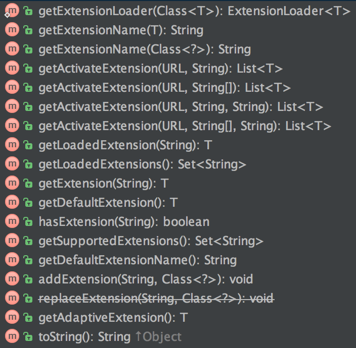

## Dubbo源码解析 --- 关于dubbo的插件化
----------

##### 前言<br/>
Dubbo的插件化实现非常类似于原生的JAVA的SPI：***它只是提供一种协议，并没有提供相关插件化实施的接口***。用过的同学都知道，它有一种java原生的支持类：**ServiceLoader**，通过声明接口的实现类，在META-INF/services中注册一个实现类，然后通过ServiceLoader去生成一个接口实例，当更换插件的时候只需要把自己实现的插件替换到META-INF/services中即可。<br/>

#### Dubbo的“SPI”<br/>
之前提到过，**Dubbo的SPI并非原生的SPI**，Dubbo的规则是在META-INF/dubbo、META-INF/dubbo/internal或者META-INF/services下面以需要实现的接口去创建一个文件，并且在文件中*以properties规则一样配置实现类的全面以及分配实现的一个名称*。我们看一下dubbo-cluster模块的META-INF.dubbo.internal：<br/>

```
mock=com.alibaba.dubbo.rpc.cluster.support.wrapper.MockClusterWrapper
failover=com.alibaba.dubbo.rpc.cluster.support.FailoverCluster
failfast=com.alibaba.dubbo.rpc.cluster.support.FailfastCluster
failsafe=com.alibaba.dubbo.rpc.cluster.support.FailsafeCluster
failback=com.alibaba.dubbo.rpc.cluster.support.FailbackCluster
forking=com.alibaba.dubbo.rpc.cluster.support.ForkingCluster
available=com.alibaba.dubbo.rpc.cluster.support.AvailableCluster
mergeable=com.alibaba.dubbo.rpc.cluster.support.MergeableCluster
broadcast=com.alibaba.dubbo.rpc.cluster.support.BroadcastCluster
```

#### ExtensionLoader<br/>
Dubbo对这一块的实现全部都集中在类**ExtensionLoader**中，那么接下来将围绕这个类来介绍Dubbo插件化的实现，在介绍Dubbo插件化实施之前，需要知道**Dubbo框架是以URL为总线的模式**，即运行过程中所有的状态数据信息都可以通过URL来获取，比如当前系统采用什么序列化，采用什么通信，采用什么负载均衡等信息，都是通过URL的参数来呈现的，所以在框架运行过程中，运行到某个阶段需要相应的数据，都可以通过对应的Key从URL的参数列表中获取，比如在cluster模块，到服务调用触发到该模块，则会从URL中获取当前调用服务的负载均衡策略，以及mock信息等。<br/>

ExtensionLoader是一个单例，通过getExtensionLoader创建一个ExtensionLoader实例，这个方法的入参是一个Class类型，这个方法的意思是返回某个接口的ExtensionLoader，我们看一下getExtensionLoader方法：<br/>

```
private static final ConcurrentMap<Class<?>, ExtensionLoader<?>> EXTENSION_LOADERS = new ConcurrentHashMap<Class<?>, ExtensionLoader<?>>();

...
ExtensionLoader<T> loader = (ExtensionLoader<T>) EXTENSION_LOADERS.get(type);
if (loader == null) {
	//这里的EXTENSION_LOADERS我们可以看到,是一个ConcurrentHashMap,key为class,值为这个class的ExtensionLoader
	EXTENSION_LOADERS.putIfAbsent(type, new ExtensionLoader<T>(type));
	loader = (ExtensionLoader<T>) EXTENSION_LOADERS.get(type);
}
return loader;
```
我们继续看一下ExtensionLoader声明的方法：<br/>

我们可以看到声明的方法可以归为几类，分别是*activate extension*、*adaptive extension*、*default extension*、*get extension by name*以及*supported extension*。可以发现activate extension都需要传入url参数，这里涉及到Activate注解，下面讲解一下这个注解。<br/>

##### Activate注解
这个注解主要用处是标注在插件接口实现类上，用来配置该扩展实现类激活条件。在Dubbo框架里面的Filter的各种实现类都通过Activate标注，用来描述该Filter什么时候生效。比如MonitorFilter通过Activate标注用来告诉Dubbo框架这个Filter是在服务提供端和消费端会生效的；而TimeoutFilter则是只在服务提供端生效，消费端是不会调用该Filter；ValidationFilter要激活的条件除了在消费端和服务提供端激活。<br/>

它还配置了value，这个表述另一个激活条件，上面介绍要获取activate extension都需要传入URL对象，那么这个value配置的值则表述URL必须有指定的参数才可以激活这个扩展。例如ValidationFilter则表示URL中必须包含参数validation(Constants.VALIDATION_KEY常量的值就是validation)，否则即使是消费端和服务端都不会激活这个扩展实现。<br/>
仔细的同学还会发现在ValidationFilter中的Activate注解还有一个参数order，这是表示一种排序规则。因为一个接口的实现有多种，返回的结果是一个列表，如果不指定排序规则，那么可能列表的排序不可控，为了实现这个所以添加了order属性用来控制排序，其中order的值越大，那么该扩展实现排序就越靠前。除了通过order来控制排序，还有before和after来配置当前扩展的位置，before和after配置的值是扩展的别名（扩展实现的别名是在上面第一段代码中，***等号左边内容（failover、mock等等）***，下面出现的别名均是此内容）：<br/>

```
@Activate(group = {Constants.PROVIDER, Constants.CONSUMER})
public class MonitorFilter implements Filter {……}

@Activate(group = Constants.PROVIDER)
public class TimeoutFilter implements Filter {……}

@Activate(group = { Constants.CONSUMER, Constants.PROVIDER }, value = Constants.VALIDATION_KEY, order = 10000)
public class ValidationFilter implements Filter {……}
```

在Dubbo框架中对这个用的最多的就是Filter的各种实现，因为**Dubbo的调用会经过一个过滤器链**，哪些Filter这个链中是通过各种Filter实现类的Activate注解来控制的。包括上面说的排序，也可以理解为过滤器链中各个Filter的前后顺序。这里的顺序需要注意一个地方，***这里的排序均是框架本身实现扩展的进行排序，用户自定义的扩展默认是追加在列表后面***。说到这里具体例子：<br/>

```
<dubbo:reference id = "..." interface = "..." ... filter = "A,B,C"/>
```
假设上面是一个有效的消费端服务引用，其中配置了一个filter属性，并且通过逗号隔开配置了三个过滤器A，B，C（A，B，C均为Filter实现的别名），那么对于该接口调用的过滤器链是怎么样的呢？首先Dubbo会加载默认的过滤器（一般消费端有三个ConsumerContextFilter，MonitorFilter，FutureFilter），并且对这些默认的过滤器实现进行排序（ActivateComparator实现排序逻辑），*这些默认过滤器实现会在过滤器链前面，后面紧接着的才是A，B，C三个自定义过滤器*。<br/>

##### Adaptive注解<br/>
下面介绍ExtensionLoader另一个重要模块adaptive extension。<br/>
Dubbo框架提供的各种接口均有很多种类的实现，在引用具体实现的时候不可能通过硬编码制定引用哪个实现，这样整个框架的灵活性严重降低。所以为了能够适配一个接口的各种实现，便有了adaptive extension这一说。对一个接口实现的适配器Dubbo提供两种途径：<br/>

1. 对某个接口实现对应的适配器。<br/>
2. Dubbo框架动态生成适配器类。<br/>

先对第一种途径进行介绍，这种途径也最好理解，对于这种途径Dubbo也提供了一个注解—Adaptive，他用来标注在接口的某个实现上，表示这个实现并不是提供具体业务支持，而是作为该接口的适配器。<br/>
对于这种途径的使用在Dubbo框架中ExtensionFactory的实现类AdaptiveExtensionFactory就是实现适配的功能，它的类被Adaptive进行了标注，那么**当调用ExtensionLoader.getExtensionLoader(ExtensionFactory.class).getAdaptiveExtension()的时候将会返回AdaptiveExtensionFactory实例**，*用来适配ExtensionFactory接口的SPIExtensionFactory和SpringExtensionFactory两种实现*，AdaptiveExtensionFactory将会根据运行时的状态来确定具体调用ExtensionFactory的哪个实现。<br/>

而第二种相对于第一种来说就隐晦一点，是ExtensionLoader通过分析接口配置的adaptive规则动态生成adaptive类并且加载到ClassLoader中，来实现动态适配。<br/>

配置adaptive的规则也是通过Adaptive注解来设置，该注解有一个**value属性**，通过设置这个属性便可以设置该接口的Adaptive的规则。上面说过服务调用的所有数据均可以从URL获取（Dubbo的URL总线模式），那么需要Dubbo帮我们动态生成adaptive的扩展接口的方法入参必须包含URL，这样才能根据运行状态动态选择具体实现。这里列举一下Transporter接口中配置adaptive规则：<br/>

```
@SPI("netty")
public interface Transporter {

    /**
     * Bind a server.
     * 
     * @see com.alibaba.dubbo.remoting.Transporters#bind(URL, Receiver, ChannelHandler)
     * @param url server url
     * @param handler
     * @return server
     * @throws RemotingException 
     */
    @Adaptive({Constants.SERVER_KEY, Constants.TRANSPORTER_KEY})
    Server bind(URL url, ChannelHandler handler) throws RemotingException;

    /**
     * Connect to a server.
     * 
     * @see com.alibaba.dubbo.remoting.Transporters#connect(URL, Receiver, ChannelListener)
     * @param url server url
     * @param handler
     * @return client
     * @throws RemotingException 
     */
    @Adaptive({Constants.CLIENT_KEY, Constants.TRANSPORTER_KEY})
    Client connect(URL url, ChannelHandler handler) throws RemotingException;
}
```
Transporter接口提供了两个方法，一个是connect（用来创建客户端连接），另一个是bind（用来绑定服务端端口提供服务），并且这两个方法上面均通过Adaptive注解配置了value属性，*bind配置的是server和transporter*，*connect配置的是client和transporter*。那么配置这些值有什么用呢？下面看看ExtensionLoader根据这些生成了什么样的adaptive代码：<br/>

```
package com.alibaba.dubbo.remoting;

import com.alibaba.dubbo.common.extension.ExtensionLoader;

public class Transporter$Adpative implements com.alibaba.dubbo.remoting.Transporter{

	public com.alibaba.dubbo.remoting.Client connect(com.alibaba.dubbo.common.URL arg0, com.alibaba.dubbo.remoting.ChannelHandler arg1) throws com.alibaba.dubbo.remoting.RemotingException {
		if (arg0 == null) 
			throw new IllegalArgumentException("url == null");
		
		com.alibaba.dubbo.common.URL url = arg0;

		String extName = url.getParameter("client", url.getParameter("transporter", "netty"));

		if(extName == null) 
			throw new IllegalStateException("Fail to get extension(com.alibaba.dubbo.remoting.Transporter) name from url(" + url.toString() + ") use keys([client, transporter])");

		com.alibaba.dubbo.remoting.Transporter extension = (com.alibaba.dubbo.remoting.Transporter)ExtensionLoader.getExtensionLoader
		
		(com.alibaba.dubbo.remoting.Transporter.class).getExtension(extName);

		return extension.connect(arg0, arg1);
	}

	public com.alibaba.dubbo.remoting.Server bind(com.alibaba.dubbo.common.URL arg0, com.alibaba.dubbo.remoting.ChannelHandler arg1) throws com.alibaba.dubbo.remoting.RemotingException {
		if (arg0 == null) 
			throw new IllegalArgumentException("url == null");

		com.alibaba.dubbo.common.URL url = arg0;

		String extName = url.getParameter("server", url.getParameter("transporter", "netty"));

		if(extName == null) 
			throw new IllegalStateException("Fail to get extension(com.alibaba.dubbo.remoting.Transporter) name from url(" + url.toString() + ") use keys([server, transporter])");

		com.alibaba.dubbo.remoting.Transporter extension = (com.alibaba.dubbo.remoting.Transporter)ExtensionLoader.getExtensionLoader

		(com.alibaba.dubbo.remoting.Transporter.class).getExtension(extName);
		
		return extension.bind(arg0, arg1);
	}
}
```
我们先看一下这两个方法的实现：<br/>

* 可以看到bind方法先对url参数(arg0)进行了非空判断，然后便是调用url.getParameter方法，首先是获取server参数，如果没有则获取transporter参数，最后如果两个参数均没有，***extName则是netty（url.getParameter("server", url.getParameter("transporter", "netty"))，这里的第二个值时默认值）***。获取完参数之后，紧接着对extName进行非空判断，接下来是获取Transporter的ExtensionLoader，并且获取别名为extName的Transporter实现，并调用对应的bind，进行绑定服务端口操作。<br/>

* connect也是类似，只是它首先是从url中获取client参数，再获取transporter参数，同样如果最后两个参数都没有，那么extName也是netty，也依据extName获取对已的接口扩展实现，调用connect方法。<br/>

到这里或许你已经明白了ExtensionLoader是怎么动态生成adaptive，上面从url中获取server、client还是transporter参数均是在Transporter接口的方法通过Adaptive注解配置的value属性。其中netty是通过注解SPI制定当前接口的一种默认实现。这便是Dubbo通过ExtensionLoader动态生成adaptive类来动态适配接口的所有实现。<br/>

##### 其他部分<br/>
上面对activate和adaptive进行了详细的介绍，这两部分对已ExtensionLoader的实现分别是方法getActivateExtension(URL url, String[] values, String group) 和createAdaptiveExtensionClassCode()。如果感兴趣，可以去查看ExtensionLoader源码。<br/>

接下来对get extension by name和default extension介绍一下，get extension by name这个没什么好介绍的，就是通过接口实现的别名来获取某一个具体的服务。<br/>

而default extension需要坐一下详细介绍，Dubbo的SPI规范除了上面说的在制定文件夹下面描述服务的实现信息之外，***被实现的接口必须标注SPI注解***，用来告诉Dubbo这个接口是通过SPI来进行扩展实现的，否则ExtensionLoader不会对这个接口创建ExtensionLoader实体，并且调用ExtensionLoader.getExtensionLoader方法会出现IllegalArgumentException异常。<br/>

这些和默认扩展实现有什么关系呢？**在接口上标注SPI注解的时候可以配置一个value属性用来描述这个接口的默认实现别名**，例如上面Transporter的@SPI(“netty”)就是指定Transporter默认实现是NettyTransporter，因为NettyTransporter的别名是netty。这里再对服务别名补充有点，别名是站在某一个接口的维度来区分不同实现的，所以**同一个接口的实现不能有相同的别名**，否则Dubbo框架将启动失败，当然**不同接口的各自实现别名可以相同**。<br/>

#### 总结<br/>
到此关于Dubbo插件化的内容介绍完了，其实*可以把ExtensionLoader当作是Spring的IOC容器*，只不过IOC容器里面做的事情是帮我们初始化和管理bean，我们可以根据我们需要的bean类型或者bean的id来获取对应的bean实体。*而Dubbo里面的ExtensionLoader同样，只不过它管理的是插件*。同样我们可以根据具体插件实现别名和插件接口来获取我们想要的插件实现。另一个不同点是Spring是通过XML的方式告诉Spring我的bean的实现类全路径，而Dubbo则是通过SPI的方式告诉ExtensionLoader具体实现类信息。<br/>
