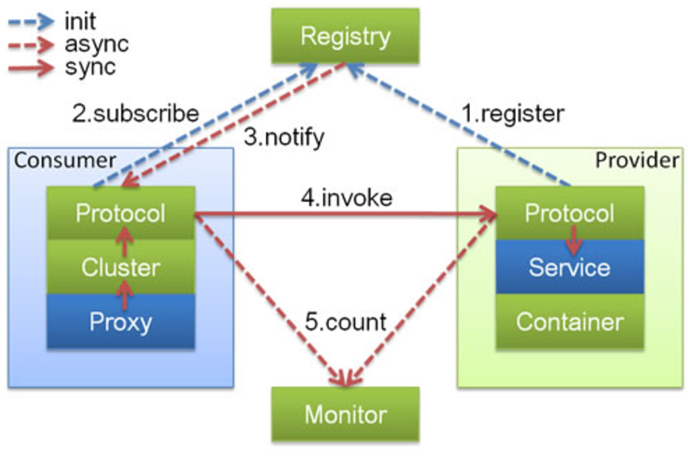
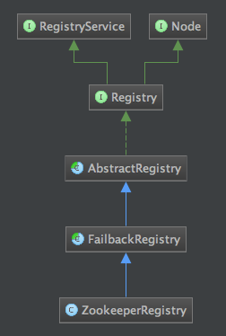
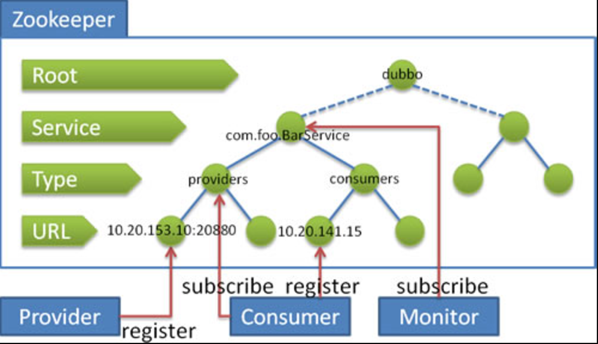

## Dubbo源码解析 --- 服务注册
----------

##### 前言<br/>
对于分布式服务架构，解决服务的发现问题，引入了注册中心中间件，从而很好的解决了服务双方（消费方和提供方）的直接依赖问题。这种解耦的意义是非凡的，不仅在程序运行时保证了灵活性，在开发阶段也使得快速迭代成为了可能，甚至在运维层面也提供了非常好的自由度。<br/>

夸了这么多，但要实现一个完美的注册中心系统却不是一件那么容易的事儿，你必须时刻注意关注它的可用性（包括稳定，***实时***和***高效***），这一点在任何一款分布式系统中都是件很复杂的事儿。当然这篇文章并不是打算摆平这么个庞然大物，我们只是从dubbo和zookeeper之间的关系来了解一下在dubbo架构中注册中心的相关知识。<br/>

#### 官方解读<br/>
先来看一下官方给出的一张描述服务提供方、服务消费方和注册中心的关系图，其实dubbo提供多种注册中心实现，不过常用的就是*zookeeper*，我们也就拿它来当例子来分析：

<br/>
从图中可见，***消费方远程调用服务方是不通过注册中心的（这句话非常重要，因为就在写这篇文章的上一周，我跟着释迦去面试一个实习生的时候，他在介绍dubbo的时候说：每次消费方调用远程服务都走注册中心，这是不对的！）***，这有效的降低了注册中心的负载，也不会存在明显的单点瓶颈（尽管可以搭建注册中心的集群，但每次调用都走注册中心的话肯定对性能产生较大的伤害）。<br/>

官方提供的规则是：<br/>

* 注册中心负责服务地址的注册与查找，相当于目录服务，***服务提供者和消费者只在启动时与注册中心交互（还是上面提到的那句话，消费方远程调用服务方是不通过注册中心的）***，注册中心不转发请求，压力较小；<br/>
* 注册中心，服务提供者，服务消费者***三者之间均为长连接***；<br/>
* 注册中心通过长连接感知服务提供者的存在，服务提供者宕机，注册中心将立即推送事件通知消费者；<br/>
* 注册中心返回服务提供者地址列表给消费者，如果有变更，注册中心将基于长连接推送变更数据给消费者；<br/>
* 注册中心全部宕机，不影响已运行的提供者和消费者，***消费者在本地缓存了提供者列表（dubbo默认30s从注册中心获取一次提供者列表）**；<br/>
* 注册中心是可选的，服务消费者可以直连服务提供者；<br/>
* 注册中心对等集群，任意一台宕掉后，将自动切换到另一台。<br/>

以上是官方解释，其中也加入了我个人认为比较重要的一些点，下面看源码~ <br/>

##### registry<br/>
为了不用让大家去翻以前的文章，我们这里直接新举一个XML配置例子：<br/>

```
<dubbo:application name="demo-provider" owner="programmer" organization="dubbox"/>
<dubbo:registry address="zookeeper://127.0.0.1:2181"/>
<dubbo:protocol name="dubbo" serialization="kryo" optimizer="com.alibaba.dubbo.demo.SerializationOptimizerImpl"/>

<bean id="bidService" class="com.alibaba.dubbo.demo.bid.BidServiceImpl" />
<dubbo:service interface="com.alibaba.dubbo.demo.bid.BidService" ref="bidService"  protocol="dubbo"/>
```

映射出来的URL是这样的：<br/>

```
//exportLocal
injvm://127.0.0.1/com.alibaba.dubbo.demo.bid.BidService?anyhost=true&application=demo-provider&dubbo=2.0.0&generic=false&interface=com.alibaba.dubbo.demo.bid.BidService&methods=throwNPE,bid&optimizer=com.alibaba.dubbo.demo.SerializationOptimizerImpl&organization=dubbox&owner=programmer&pid=3872&serialization=kryo&side=provider&timestamp=1422241023451

//exportRemote
registry://127.0.0.1:2181/com.alibaba.dubbo.registry.RegistryService?application=demo-provider&dubbo=2.0.0&export=dubbo%3A%2F%2F192.168.153.1%3A20880%2Fcom.alibaba.dubbo.demo.bid.BidService%3Fanyhost%3Dtrue%26application%3Ddemo-provider%26dubbo%3D2.0.0%26generic%3Dfalse%26interface%3Dcom.alibaba.dubbo.demo.bid.BidService%26methods%3DthrowNPE%2Cbid%26optimizer%3Dcom.alibaba.dubbo.demo.SerializationOptimizerImpl%26organization%3Ddubbox%26owner%3Dprogrammer%26pid%3D3872%26serialization%3Dkryo%26side%3Dprovider%26timestamp%3D1422241023451&organization=dubbox&owner=programmer&pid=3872&registry=zookeeper&timestamp=1422240274186
```

这里也体现出了dubbo的以URL为总线模式的特点。以这个url为基准暴露服务的话，dubbo会首先会根据指定协议（registry）拿到对应的protocol（RegistryProtocol），这部分是怎么做到的呢？还是之前通过IDE拿到的dubbo动态创建的protocol自适应扩展点，我们重点看Protocol$Adaptive的export方法：<br/>

```
public com.alibaba.dubbo.rpc.Exporter export(com.alibaba.dubbo.rpc.Invoker arg0) throws com.alibaba.dubbo.rpc.Invoker {
	if (arg0 == null) 
		throw new IllegalArgumentException("com.alibaba.dubbo.rpc.Invoker argument == null");

	if (arg0.getUrl() == null) 
		throw new IllegalArgumentException("com.alibaba.dubbo.rpc.Invoker argument getUrl() == null");

	com.alibaba.dubbo.common.URL url = arg0.getUrl();
	//注意这句，根据我们的例子，extName=registry
	String extName = ( url.getProtocol() == null ? "dubbo" : url.getProtocol() );    

	if(extName == null)
		throw new IllegalStateException("Fail to get extension(com.alibaba.dubbo.rpc.Protocol) name from url(" + url.toString() + ") use keys([protocol])");
	
	//根据扩展点加载规则，最终拿到RegistryProtocol实例。
	com.alibaba.dubbo.rpc.Protocol extension = (com.alibaba.dubbo.rpc.Protocol)ExtensionLoader.getExtensionLoader(com.alibaba.dubbo.rpc.Protocol.class).getExtension(extName);

	return extension.export(arg0);
}
```

可能有些同学要问，URL中并没有一个类似protocol=...的键值对啊，为什么extName = registry呢？这里我们看一下URL的源代码，其中有这么一段：<br/>

```
String protocol = null;
i = url.indexOf("://");
if (i >= 0) {
	if (i == 0) throw new IllegalStateException("url missing protocol: \"" + url + "\"");
	//联系上文的i = url.indexOf("://")，我们知道了protocol就是url中'://'标识符的前面一个字符串
	protocol = url.substring(0, i);
	url = url.substring(i + 3);
}
```

我们接着开RegistryProtocol，注意一个其中的私有属性：<br/>

```
private Protocol protocol;

public void setProtocol(Protocol protocol) {
    this.protocol = protocol;   //由SPI机制为其赋予一个protocol的自适应扩展点（动态创建的）
}
```
这个属性真正被赋值的地方是在SPI机制中为扩展点注入的阶段（injectExtension方法），该部分的内容请查看dubbo插件化的部分，这里不带着大家继续看了。<br/>

回到RegistryProtocol类，我们知道，在服务暴露阶段，会调用它的export方法，在这个方法里会完成服务的注册逻辑：<br/>

```
public <T> Exporter<T> export(final Invoker<T> originInvoker) throws RpcException {
    //export invoker
    final ExporterChangeableWrapper<T> exporter = doLocalExport(originInvoker); //完成真正的服务暴露逻辑：默认以netty创建server服务来处理远程调用，打算回头专门写一下dubbo使用netty的细节

    //registry provider
    final Registry registry = getRegistry(originInvoker);  //根据url参数获取对应的注册中心服务实例，这里就是ZookeeperRegistry

    final URL registedProviderUrl = getRegistedProviderUrl(originInvoker);
    registry.register(registedProviderUrl); //向注册中心注册当前暴露的服务的URL

    // 订阅override数据
    // FIXME 提供者订阅时，会影响同一JVM既暴露服务，又引用同一服务的的场景，因为subscribed以服务名为缓存的key，导致订阅信息覆盖。
    final URL overrideSubscribeUrl = getSubscribedOverrideUrl(registedProviderUrl);
    final OverrideListener overrideSubscribeListener = new OverrideListener(overrideSubscribeUrl);
    overrideListeners.put(overrideSubscribeUrl, overrideSubscribeListener);
    registry.subscribe(overrideSubscribeUrl, overrideSubscribeListener);

    //保证每次export都返回一个新的exporter实例
    return new Exporter<T>() {
        public Invoker<T> getInvoker() {
            return exporter.getInvoker();
        }
        public void unexport() {
            try {
                exporter.unexport();
            } catch (Throwable t) {
                logger.warn(t.getMessage(), t);
            }
            try {
                registry.unregister(registedProviderUrl);
            } catch (Throwable t) {
                logger.warn(t.getMessage(), t);
            }
            try {
                overrideListeners.remove(overrideSubscribeUrl);
                registry.unsubscribe(overrideSubscribeUrl, overrideSubscribeListener);
            } catch (Throwable t) {
                logger.warn(t.getMessage(), t);
            }
        }
    };
}
```

我们接下来看一下dubbo和zookeeper之间在服务注册阶段的通信细节，要从上面这个方法中的下面三行下手：<br/>

```
//registry provider
//根据url参数获取对应的注册中心服务实例，这里就是ZookeeperRegistry
final Registry registry = getRegistry(originInvoker);

final URL registedProviderUrl = getRegistedProviderUrl(originInvoker);
//向注册中心注册当前暴露的服务的URL
registry.register(registedProviderUrl);
```

正如注释标明的，第一行会获取invoker中url指定的注册中心实例，我们的情况就是拿到zookeeperRegistry。第二行其实就是过滤掉url中的注册中心相关参数，以及过滤器，监控中心等参数，按照我们上面的例子，registedProviderUrl大概应该如下：<br/>

```
dubbo://192.168.153.1:20880/com.alibaba.dubbo.demo.bid.BidService?anyhost=true&application=demo-provider&dubbo=2.0.0&generic=false&interface=com.alibaba.dubbo.demo.bid.BidService&methods=throwNPE,bid&optimizer=com.alibaba.dubbo.demo.SerializationOptimizerImpl&organization=dubbox&owner=programmer&pid=3872&serialization=kryo&side=provider&timestamp=1422241023451
```

我们主要看第三行，真正完成向zookeeper中注册的工作就是靠register方法完成的。先来看一下ZookeeperRegistry的继承关系：<br/>

<br/>
*真正声明register方法的是zookeeperRegistry的父类：FailbackRegistry*，从名字就能直观的看出它的作用，主要就是负责注册中心失效重试逻辑的。<br/>
继续看ZookeeperRegistry的doRegister方法（FailbackRegistry的register方法会调用ZookeeperRegistry的doRegister的方法，这里的doRegister就是一个抽象方法，真正的实现在ZookeeperRegistry中）：<br/>

```
protected void doRegister(URL url) {
	try {
		//这里的zkClient是被dubbo封装过的对象。
		zkClient.create(toUrlPath(url), url.getParameter(Constants.DYNAMIC_KEY, true));
	} catch (Throwable e) {
		throw new RpcException("Failed to register " + url + " to zookeeper " + getUrl() + ", cause: " + e.getMessage(), e);
	}
}
```

到这里就已经可以告一段落了，需要叮嘱的是***toUrlPath***方法，它的作用就是把url格式化成最终存储在zookeeper中的数据格式，尤其要注意category参数，它表示注册类型，如下图：<br/>

<br/>
在我们的例子中，最终这次注册就会在对应serverInterface下的providers下创建一个url节点。