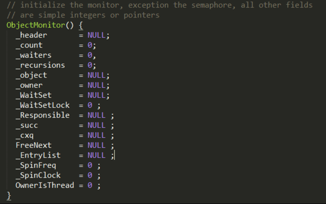
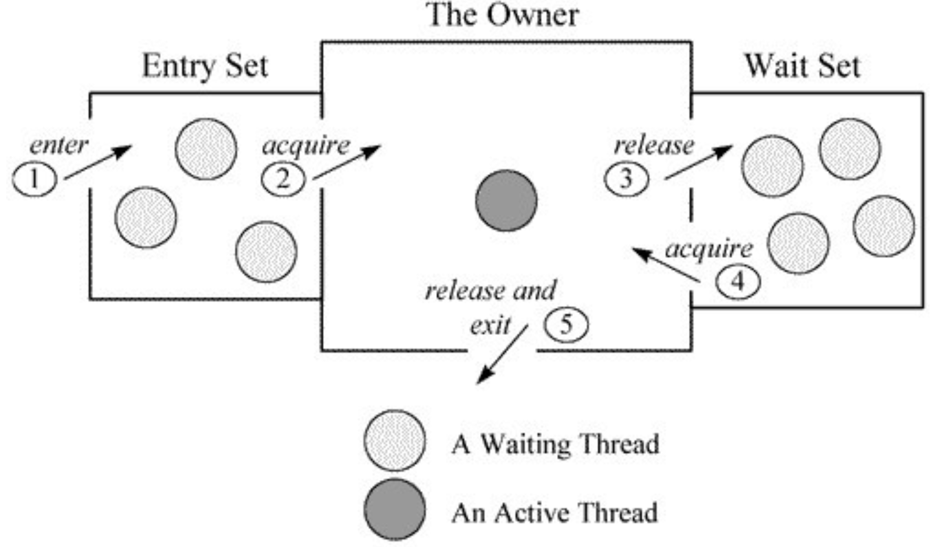
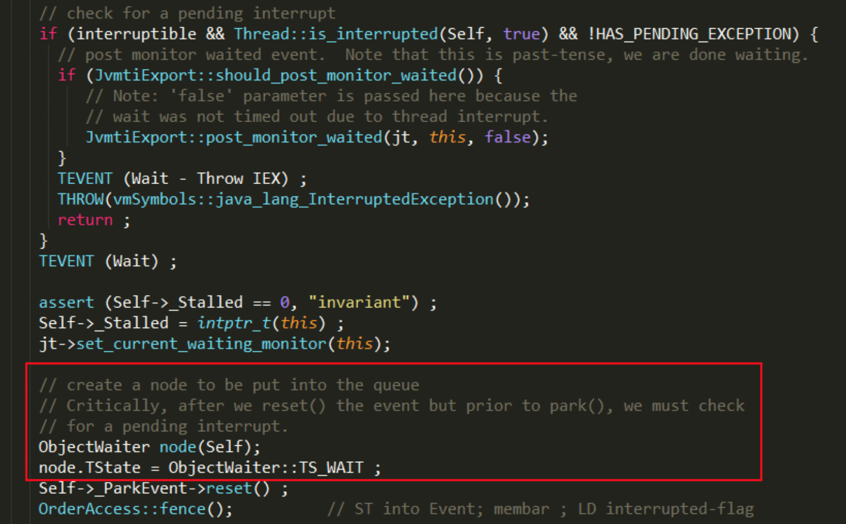
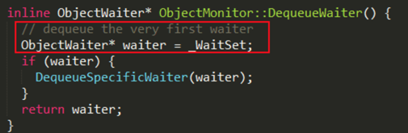

#### 深入分析Object.wait/notify实现机制 

同一个obj对象调用wait、notify方法。 
1. 当线程A执行wait方法时，该线程被挂起。 
2. 当线程B执行notify方法时，唤醒一个被挂起的线程A。 

lock对象、线程A和线程B三者是一种什么关系？根据上面的结论，可以想象一个场景： 
1. lock对象维护了一个等待队列list； 
2. 线程A中执行lock的wait方法，把线程A保存到list中； 
3. 线程B中执行lock的notify方法，从等待队列中取出线程A继续执行。 

使用过程中有这么几个疑问： 
1. *进入wait/notify之前为什么要获取synchronized*？ 
2. *线程A获取了synchronized锁，执行wait方法挂起，线程B如何再次获得锁*？ 

synchronized的底层实现不多说了，主要是通过底层的monitor来实现的，详细请参考[synchronized 关键字](http://blog.shiwuliang.com/2017/02/25/synchronized%20%E5%85%B3%E9%94%AE%E5%AD%97/)。obj的wait方法通过调用native方法wait(0)实现，接口注释中有这么一句： 
> The current thread must own this object's monitor.

 
### 代码执行过程分析 

1. 在多核环境下，线程A和B有可能同时执行monitorenter指令，并获取lock对象关联的monitor，只有一个线程可以和monitor建立关联，假设线程A执行加锁成功； 

2. 线程B竞争加锁失败，进入等待队列进行等待； 

3. 线程A继续执行，当执行到wait方法时，会发生什么？wait接口注释： 

> wait方法会将当前线程放入wait set，等待被唤醒，并放弃lock对象上的所有同步声明。
 

意味着线程A释放了锁，线程B可以重新执行加锁操作。那么A线程wait方法释放锁，B线程获取锁，线程B怎么知道A已经释放了锁？这一部分同样参考synchronize关键字 

B执行加锁成功，执行notify/notifyAll方法，关于这两个方法的说明这里不再阐述，一个唤醒一个线程，一个唤醒所有线程。 

### 重提MONITOR 

HotSpot虚拟机中，monitor采用ObjectMonitor实现。 

 
每个线程都有两个ObjectMonitor对象**列表**，分别为**free**和**used**列表，如果当前free列表为空，线程将向全局global list请求分配ObjectMonitor。 

ObjectMonitor对象中有两个队列：_WaitSet 和 _EntryList，用来保存ObjectWaiter对象列表；_owner指向获得ObjectMonitor对象的线程。 

 

***_WaitSet*** ：处于wait状态的线程，会被加入到wait set； 
***_EntryList***：处于等待锁block状态的线程，会被加入到entry set； 

***ObjectWaiter对象是双向链表结构***，保存了_thread（当前线程）以及当前的状态TState等数据， 每个等待锁的线程都会被封装成ObjectWaiter对象。 

### wait方法实现 

方法最终通过ObjectMonitor的`void wait(jlong millis, bool interruptable, TRAPS) `实现： 

 

1. 将当前线程封装成ObjectWaiter对象node； 
2. 通过`ObjectMonitor :: AddWaiter`方法将node添加到_WaitSet列表中； 
3. 通过`ObjectMonitor :: exit`方法释放当前的ObjectMonitor对象，这样其它竞争线程就可以获取该ObjectMonitor对象。 
4. 最终底层的park方法会挂起线程。 

### notify方法实现 

方法最终通过ObjectMonitor的void notify(TRAPS)实现： 
1. 如果当前_WaitSet为空，即没有正在等待的线程，则直接返回； 
2. 通过`ObjectMonitor :: DequeueWaiter`方法，获取_WaitSet列表中的第一个ObjectWaiter节点，实现也很简单。 

 

这里我们就知道了，notify的方法注释是随机唤醒一个线程，其实是唤醒第一个ObjectWaiter节点！ 

3. 根据不同的策略，将取出来的ObjectWaiter节点，加入到*_EntryList*或通过`Atomic :: cmpxchg_ptr`指令进行自旋操作cxq，具体代码实现有点长，这里就不贴了，有兴趣的同学可以看`objectMonitor :: notify`方法。 

### notifyAll方法实现 

方法最终通过ObjectMonitor的void notifyAll(TRAPS)实现：通过for循环取出*_WaitSet*的ObjectWaiter节点，并根据不同策略，加入到*_EntryList*或则进行自旋操作。 

原文地址 http://www.jianshu.com/p/f4454164c017
